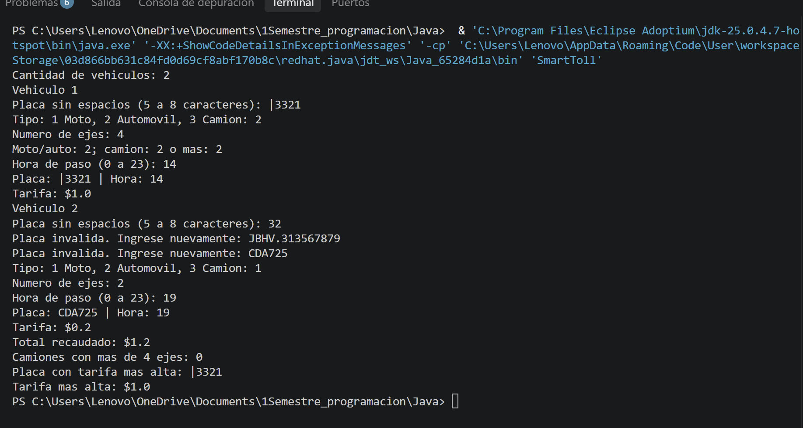

<h1 align="center">Prueba-Practica · SmartToll</h1>

<p align="center">
  <strong>🦇 LA BATICUEVA DEL CÓDIGO · GOTHAM CODE DIVISION · GRUPO 1</strong><br>
  <em>Gotham tiene misterios. Nosotros tenemos un peaje por controlar.</em>
</p>

<div align="center">


<h2>🦇 EL PEAJE QUE GOTHAM NECESITA</h2>


**La noche es oscura. La lógica debe estar clara.**


<br>


<br><br>

**Bienvenidos a la Baticueva, nuestra base de operaciones.**<br>
Esta vez la misión es vigilar la entrada a Gotham: cada vehículo que cruza el peaje<br>
debe identificarse, pagar la tarifa correcta y quedar registrado.

**Cinco mentes. Un equipo. Un peaje.**

</div>

---

## 🦇 Nuestro equipo · La Batfamilia del código

Todo gran reto necesita un equipo dispuesto a resolverlo. Nuestra mesa de la Baticueva reúne cinco perspectivas para compartir preguntas, discutir alternativas y aprender durante el proceso.

| N.º | BatIntegrante | BatOperaciones | BatObjetivo |
| :---: | :--- | :--- | :--- |
| **1** | **Paredes Acosta Dereck Shair** | **Detective del Código Oscuro · Investigar · Analista** | Identificar los datos de entrada, las condiciones y el resultado esperado del problema. |
| **2** | **Ashanga Yumbo Brishy Anahy** | **Arquitecto de la Baticueva Digital · Preparar · Diseñar** | Organizar una secuencia lógica de solución antes de escribir código. |
| **3** | **Calderon Carvajal Fher Dorian** | **Caballero del Backend · Construir · Programar** | Transformar el diseño en instrucciones claras, comprensibles y ordenadas. |
| **4** | **Casillas Ochoa Antony Sebastian** | **Guardián Nocturno del Testing · Inspeccionar · Probar** | Revisar casos normales, entradas inválidas y situaciones límite. |
| **5** | **Sanchez Bastidas Karina Paola** | **Oráculo del Conocimiento · Archivar · Documentar** | Explicar el funcionamiento, las decisiones y lo aprendido para facilitar la revisión. |

**La mejor herramienta de la Baticueva es trabajar juntos.**

---

# 🗃️ Expediente asignado · GRUPO 1 – SmartToll: Peaje

> **Objetivo de la misión:** analizar el problema, diseñar una solución lógica, programarla, comprobar su funcionamiento y documentar los resultados obtenidos.

### 📋 Descripción

El programa simula el control de un peaje. Solicita la cantidad **N de vehículos** y, para cada uno, registra la **placa**, el **tipo de vehículo** (`1` Moto, `2` Automóvil, `3` Camión), el **número de ejes** y la **hora** de paso. Con un `switch` determina la tarifa correspondiente y, al finalizar, muestra:

- El **total recaudado**.
- La **cantidad de camiones con más de 4 ejes**.
- La **placa que pagó la tarifa más alta**.

### ⚙️ Estructuras utilizadas

| Estructura | Uso dentro del programa |
| :--- | :--- |
| `for` | Procesar los N vehículos. |
| `while` | Validar cada dato hasta que sea correcto. |
| `switch` | Calcular la tarifa según el tipo de vehículo. |
| `if` / `else` | Aplicar el recargo por hora pico y comparar la tarifa más alta. |
| Acumulador | Sumar el total recaudado. |
| Contador | Contar los camiones con más de 4 ejes. |
| Variables de mayor | Guardar la tarifa más alta y su placa. |

### 💰 Tabla de tarifas · Reglas del peaje de Gotham

| Tipo | Vehículo | Ejes permitidos | Tarifa base |
| :---: | :--- | :---: | :--- |
| **1** | Moto | 2 | $1,00 |
| **2** | Automóvil | 2 | $2,00 |
| **3** | Camión | 2 a 9 | $1,50 por eje |

> **Hora pico:** de 07:00 a 09:59 y de 17:00 a 19:59 se aplica un **recargo del 20 %** sobre la tarifa base. La hora se ingresa como un entero de `0` a `23`.

### 🛡️ Validaciones y criterios

- **N** debe ser un entero mayor que cero.
- La **placa** no puede estar vacía.
- El **tipo** solo acepta `1`, `2` o `3`.
- Los **ejes** deben corresponder al tipo: moto y automóvil con 2 ejes; camión de 2 a 9 ejes.
- La **hora** debe estar entre `0` y `23`.
- Si un dato es inválido, se muestra un mensaje y se vuelve a solicitar sin avanzar al siguiente vehículo.
- Un camión cuenta como **“más de 4 ejes”** solo si tiene 5 o más ejes.
- Si dos vehículos empatan en la tarifa más alta, se conserva la **primera placa** registrada.

---

# ⚙️ Instrucciones de ejecución · Activando la Baticomputadora

Para ejecutar el programa se debe contar con **Java (JDK 8 o superior)** instalado correctamente en el computador.

El ejercicio puede ejecutarse utilizando:

- Visual Studio Code.
- Apache NetBeans.
- IntelliJ IDEA.
- Eclipse.
- Terminal o consola.

## 🖥️ Ejecución desde un IDE

1. Descargar o clonar este repositorio.
2. Abrir la carpeta del proyecto en el IDE.
3. Abrir el archivo `SmartToll.java`.
4. Verificar que el programa contenga:

```java
public static void main(String[] args)
```

5. Compilar y ejecutar el archivo.
6. Ingresar los datos solicitados en consola.
7. Revisar el resumen final del peaje.

## 💻 Ejecución desde terminal

### Clonar el repositorio

```bash
git clone <URL-del-repositorio>
cd <carpeta-del-repositorio>
```

### Compilar

```bash
javac SmartToll.java
```

### Ejecutar

```bash
java SmartToll
```

> Estos comandos se ejecutan desde la carpeta donde está `SmartToll.java` y corresponden a una clase sin declaración `package`. Si el proyecto usa paquetes, ejecutarlo desde el IDE con su estructura de carpetas.

---

# 🧪 Casos de prueba · Inspección de la Baticueva

> **Regla de la Baticueva:** ningún caso se cierra solo porque «en mi computadora sí funciona».

### 🦇 Caso 1 · Caso normal (los tres tipos de vehículo)

| Vehículo | Placa | Tipo | Ejes | Hora | Tarifa |
| :---: | :--- | :--- | :---: | :---: | :--- |
| 1 | `ABC-1234` | 2 · Automóvil | 2 | 10 | $2,00 |
| 2 | `PBX-0567` | 3 · Camión | 5 | 14 | 5 × $1,50 = $7,50 |
| 3 | `IA123B` | 1 · Moto | 2 | 8 | $1,00 + 20 % = $1,20 |

**Entrada:** N = 3 con los datos anteriores.

**Resultado esperado:** total recaudado: **$10,70**; camiones con más de 4 ejes: **1**; tarifa más alta: **PBX-0567 ($7,50)**.

### 🦇 Caso 2 · Caso límite (camión con exactamente 4 ejes)

| Vehículo | Placa | Tipo | Ejes | Hora | Tarifa |
| :---: | :--- | :--- | :---: | :---: | :--- |
| 1 | `TCA-1111` | 3 · Camión | 4 | 18 | 4 × $1,50 = $6,00 + 20 % = $7,20 |
| 2 | `TCB-2222` | 3 · Camión | 6 | 12 | 6 × $1,50 = $9,00 |

**Entrada:** N = 2 con los datos anteriores.

**Resultado esperado:** total recaudado: **$16,20**; camiones con más de 4 ejes: **1** (el de 4 ejes no se cuenta); tarifa más alta: **TCB-2222 ($9,00)**.

### 🦇 Caso 3 · Entradas inválidas

| Dato ingresado | Resultado esperado |
| :--- | :--- |
| N = `0` | Rechazar y volver a solicitar N. Luego ingresar N = `1`. |
| Placa vacía | Rechazar y volver a solicitarla. Luego ingresar `ABC-1234`. |
| Tipo = `4` | Rechazar y volver a solicitarlo. Luego ingresar `2` (Automóvil). |
| Ejes = `3` para automóvil | Rechazar y volver a solicitarlos. Luego ingresar `2`. |
| Hora = `25` | Rechazar y volver a solicitarla. Luego ingresar `20`. |

**Resultado esperado:** ningún dato inválido se procesa. Total recaudado: **$2,00**; camiones con más de 4 ejes: **0**; tarifa más alta: **ABC-1234 ($2,00)**.

---

# 📸 Evidencias · Archivo fotográfico de la Baticueva

Capturas de la ejecución real del programa para cada caso de prueba.

## 📷 Evidencia · Caso 1

<p align="center">
  
</p>

## 📷 Evidencia · Caso 2

<p align="center">
  
</p>

## 📷 Evidencia · Caso 3

<p align="center">
  
</p>

---

<div align="center">

## 🦇 MISIÓN COMPLETADA


<br>

*El verdadero trabajo del detective no termina cuando el programa compila.*  
*Termina cuando comprendemos por qué funciona.*

<br>

### GOTHAM PUEDE DESCANSAR... HASTA EL PRÓXIMO BUG.

🦇

<br>

<sub>Programación · Lógica · Trabajo en equipo · Gotham Code Division · Grupo 1</sub>

</div>

---

## 🗂️ Galería de villanos

*Clasificación humorística de los enemigos del peaje.*

| Villano | Su versión en SmartToll | Cómo enfrentarlo |
| :--- | :--- | :--- |
| **El Joker** | El camión que dice ser moto. | Validar los ejes según el tipo de vehículo. |
| **El Acertijo** | La hora 25 que nadie sabe de dónde salió. | Aceptar solo valores de 0 a 23. |
| **Dos Caras** | El `switch` sin `break` que cobra dos tarifas. | Revisar cada `case` y probar los tres tipos. |
| **Bane** | El camión de 4 ejes que rompe el contador. | Probar el caso límite: más de 4 no incluye el 4. |

## ☕ Zona de descanso · Alfred sirve el café

<details>
<summary><b>🃏 El plan del Joker</b></summary>

<br>

—Batman, cambié un solo símbolo de tu condición.

—¿Qué hiciste?

—Reemplacé `ejes > 4` por `ejes >= 4`.

—¿Y ahora?

—Todos los camiones de Gotham son sospechosos.

**Siguiente misión:** probar cada condición antes de cerrar el caso.

</details>

<details>
<summary><b>💻 La Baticomputadora tiene una objeción</b></summary>

<br>

—En mi computadora sí funciona.

—Señor, esta también es su computadora.

Batman decide revisar los datos de entrada.

**El Joker queda descartado por el momento.**

</details>

---

<div align="center">

**Primero lo imaginamos. Luego lo programamos.**  
**Y si falla, lo depuramos juntos.**

🦇


</div>
